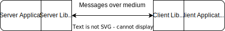
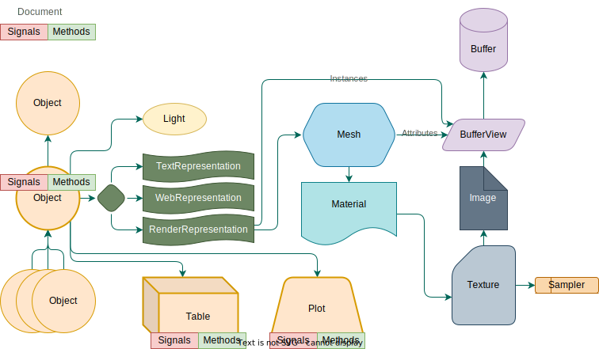

= NOODLES Specification
Nicholas Brunhart-Lupo <nicholas.brunhart-lupo@nrel.gov>
v0.4
:toc:

This document entails a specification for a distributed scene-graph wireline protocol suitable as a substrate for shared interactive visualizations. It also lays out concepts for the supporting implementations that would provide such visualizations.

== Rationale & Design Goals

* The intent of this document is simplicity, to get a working version implemented so that further improvements can be identified.
* The structure here is not intended to mirror the use-case of the HTML DOM + Javascript where code is shipped to clients. That would be restrictive, as it requires the clients either interpret or compile and run code on command. Some clients, such as integrated head mounted systems, do not allow compilation, or are not sufficient computing platforms.
* Trying to mirror just the HTML DOM part has issues as well; a number of 3D declarative implementations (like QML 3D), all operate on a scenegraph under the hood. It seems more fruitful to just target the scenegraph for modification, and perhaps (as part of the server library) have a declarative component there.
* A shared document is desired here, as opposed to the standard browser case where every client has their own copy of state.
* Code listings are provided as an example and for exposition only. Clients and servers may be written in any language as long as they conform to the proper wireline protocol.

== Architecture

The system envisions the use of four components, two of which fall under this specification.

[#img-arch]
.System architecture. Note that there may be more than one client

The Server Library presents a visualization to one or more connected clients through a synchronized scenegraph. Client requests and messages are passed on for handling to the application code, which can manipulate the scenegraph in response. These changes are then published and sent to clients.

The Client Library connects to a server, and maintains the synchronized scenegraph. This scenegraph is query-able by the client. Clients then can interpret and present the scenegraph to the user in the way they see fit. For example, an immersive graphics engine client can draw the scenegraph as is, while a 2D client can choose to present only a subset of the graph. A command line (i.e. Python) client may ignore the scenegraph completely to merely make use of the messaging and method invocation functionality. This also allows each client to customize the interactions available in a way that best aligns with their form factor.

=== Communication

The medium over which messages are sent is not specified. Raw sockets, Websockets, Bluetooth, etc, can all be used. 
Note that, at this time, websockets are preferred.

All messages are encoded using https://cbor.io/[CBOR]. For transport over websockets, these messages are sent over the binary channel.

Client-to-client notification is not supported, and must first pass through the server.

The bulk of communication is from server to client.

This spec is intended to be implemented in a secure network, with the presumption that those that connect to the server are trusted. Provision for security will come later, as is the case with everything, because security is hard and makes my brain bleed.

=== Misc

All data should be in little endian form.

Format: this describes a SIMD form for data. This uses GLSL notation. For example, `vec3` is a pack of 3 IEEE float32 values, and `u8vec4` is a pack of four unsigned bytes. The byte size of each SIMD value is the size of a single component mulitplied by the count. Some formats can be normalized; this is supported for integer formats only. Normalization (for unsigned integers) implies that 0 for a component should map to a 0.0 floating point value, and the maximum value maps to 1.0. For signed, 0 maps to -1.0, and the maximum maps to 1.0.

We follow GLTF for coordinates.

== Concepts

[#img-concepts]
.Structure and entity concepts of a NOODLES session

=== Identifiers

Elements are referred to by Identifiers.

Identifiers are a pair of 32-bit unsigned integers; the first being a slot number, and the second being a generation count. This allows non-hashed storage, as there should be no two elements with the same slot number, so it can be used as an index in an array. 

The generation number is used to help identify if a slot has been recycled by the server, and thus allow detection of stale identifier use. It is a monotonically increasing integer.
If the server informs the client of the deletion of an element with an id of (slot 3, generation 1), then any further uses of that id is invalid; the server, however may then inform the client of an elment with id (slot 3, generation 2). Upon reaching the value of 4,294,967,294 (2^32^ - 2), the slot is exhausted and cannot be used again.

An identifier where either the slot and generation are the maximum unsigned integer value (4,294,967,295) is the 'null' ID.

Slots should be allocated by the server in order, i.e., slot 1 is used before slot 2. This predictability aids clients in allocating internal data structures. Clients should, however, be prepared for out of order allocation from an unfriendly server.

=== Document

The Document represents the visualization. It is an entity-component model, with an Entity as the core node, and where Tables and Plots are secondary entities.

The document is implicit. The other elements are explicit.

=== Entity/Object

Each object is provided with an Object ID. Objects are rendered in a hierarchy. Objects can have any number of children.

Each object is a possibly render-able object, and has an optional name, a local transformation, a parent Object ID, a number of lights, and links to plots and tables. Objects also have a set of string tags, and attached methods and signals.

Objects have a number of representations:

- Null: This object is not to be displayed
- Renderable: This object should be rendered
- Web: This object should be rendered as a plane with a web page source
- Text: This object should be rendered with provided text

Objects are mutable.

=== Tables
Tables are a structured way to transmit row oriented data. They consist of a header (list of column names), and rows. Attached signals and methods are used to allow clients to modify the data in the table or fetch records (but only when first subscribed to).

Rows are referred to by monotonically increasing unsigned 64-bit keys.

Tables are mutable; their contents may be mutable as well, with changes being communicated through signals and methods.

=== Plots
Plots are a way to transmit and possibly synchronize 2D plots. They consist of either a simple textual plot definition (described below), or a URL to load in a browser.

Web-based plots can communicate with the session by loading a javascript NOODLES client.

Plots are mutable; their contents may be mutable as well.

=== Signals and Methods

Signals are notifications from the server to the client. They may contain data, and may come from the document, objects, plots, or tables.

Methods are requests to the server from the client. They may take a set of data parameters, and they may return data as well, or may return an exception. They must have a contextual object that they are called on, otherwise they are called on the Document. During the course of a method invocation, signals from the server could be generated.

Methods should be handled on the server as if they were serialized.

Each method invocation is tracked by a client-generated arbitrary string. These shall be unique and never re-used. These strings shall not exceed 64 bytes. For servers, every method must generate a reply message; the only exception is if the client did not provide an invocation identifier string. A reply will be sent with the same invocation identifier string for the client to match responses. 

There is a possibility that a method could be called on an object, that is then subsequently deleted, or replaced. In this case, a reply is still generated, and not squashed by the server; an exception is a good approach in these situations. Thus a client should be able to handle replies on objects that no longer exist.

Methods must not be called on components that they are not attached to.

Methods and signals are immutable.

=== Buffers
A buffer is an opaque block of bytes. This allows for efficient storage and transfer of large assets. These assets can be sent either inline in the message, or can be supplied through a URL that the client can fetch the buffer from.

Buffers are immutable.

=== Buffer Views
Buffer views denote regions of a given buffer. This allows for multiple compact references a range of the buffer, and allows for tagging views with information about that range. 

Views are used for images and mesh information.

Views are immutable.

=== Geometry

Geometry information is provided through patches. Each patch denotes vertex attributes and optional index information to assemble the veritices into primitives. Each patch also provides the material to be used when rendering this patch.

Primitives that are supported:

- points
- lines
- line_loop
- line_strip
- triangles
- triangle_strip

Vertex attributes are organized into semantics; each semantic can consume a certain format of data. Multiple channels of this data can be provided, using a slot notation.

.Attribute Semantics
[%header]
|===
|Semantic | Allowed Formats | Slots
| position
| vec3
| 0

| normal
| vec3
| 0

| tangent
| vec3
| 0

| texture
| vec2, u16vec2 (normalized)
| 0, 1

| color
| vec4, u8vec4 (normalized)
| 0, 1
|===

Geometry is immutable.

=== Materials

This describes a PBR based material, featuring basic elements: base color, metallic, roughness, including an optional texture for base colors. The material only applies to the patch it is attached to. Note that though the material is specified in PBR, the client may use Phong or other interpretations of the specified material in order to meet performance goals. The material may also specify that blending should be used; the blending function is $src_{\alpha}$ and $1-src_{\alpha}$.

Materials are mutable.

=== Images

Images refer to image data, in the on-disk format. Supported formats are PNG, JPG, and optionally KTX2.

Images are immutable.

=== Samplers

Samplers denote how texel lookup into Images should proceed, including filtering and out-of-bounds behavior.

Filters are:

- nearest
- linear
- linear mipmap linear

Wrap modes are:

- clamp to edge
- mirrored repeat
- repeat

Samplers are immutable.

=== Textures

Textures combine an Image combined with an optional Sampler. If no sampler is provided, a default sampler should be used.

Textures are immutable.

=== Lights

Lights describe illumination sources.

Lights are mutable.

== Common Message Semantics

All messages are defined in the `noodles.cddl` file.

== Server Messages

Almost all components have strict lifetimes defined by creation and deletion messages. Some messages are also used to update an existing component. Therefore, if a create message is received by the client for a component/entity of an ID that it has never seen before, that is the creation milestone. 

Update messages are treated with certain semantics: keys in the message add or replace keys in the destination. In an atomic update, the destination is completely replaced by the message.

If a component refers to another by an ID, the other component _must_ stay alive for the duration of the first.

=== Root Message

The server sends messages by the root type `ServerMessages`. This is an interleaved array of all other content messages. Content messages are specified in `ServerMessageMapping` along with an integer ID that is used to identify each content messages. The server messages are thus provided: `[A~id~, A~content~, B~id~, B~content~, ... ]`.

=== Entity/Object

==== Null Representation

This representation is blank. The entity has no visual component.

==== Text Representation

This entity should be represented as text, rendered as through a provided named font. The text is rendered on a plane, normal along -Z. Up is local +Y. If the optional width is specified, then the text shall, keeping the proper font aspect ratio, try to fill the bounds provided.

==== Web Representation

This entity should be represented as a web page with a given URL. The page is rendered on a plane, normal along -Z. Up is local +Y.

==== Render Representation

Instances are defined through the `InstanceSource` map, using a view of a buffer. The format must be a mat4. The view may have a stride, but it is recommended that this be zero to indicate tight packing to reduce copying and transformation costs.

Each instance is represented by a mat4, in column major format. Instances have a position `p`, rotation `r` (as a quaternion), color `c`, scale `s`. Transforms should be applied in the following order: scaling, rotation, translation.

.Instance-matrix format
[cols=4*]
|===
| p~x~ | c~r~ | r~x~ | s~x~
| p~y~ | c~g~ | r~y~ | s~y~
| p~z~ | c~b~ | r~z~ | s~z~
| -    | c~a~ | r~w~ | -
|===

=== Tables

TBD

=== Buffers

Buffers are either inline (in the `inline_bytes` field) or provided as a URL (in the `uri_bytes` field). Only one of these shall be presented, otherwise this message is malformed. 

The size of the buffer _must_ be passed as well.

=== Buffer Views

[source, cddl]
----
MsgBufferViewCreate = {
    id : BufferViewID,
    ? name : tstr,
    source_buffer : BufferID,

    type : "UNK" / "GEOMETRY" / "IMAGE",
    offset : uint,
    length : uint,
}

MsgBufferViewDelete = {
    id : BufferViewID,
}
----

Buffer views refer to a buffer `source_buffer`, and denote a range with `offset` and `length`. The view must also specify a `type`, which is a string with the following valid values:

- `"UNK"`: The view has arbitrary content.
- `"GEOMETRY"`: The view contains geometry data; vertex, index, etc, info. Instances are not geometry; they should use the `"UNK"` value.
- `"IMAGE"`: The view contains image data.

No view may overlap with another.

=== Geometry Info

[source, cddl]
----
PrimitiveType = "POINTS"/
                "LINES"/
                "LINE_LOOP"/
                "LINE_STRIP"/
                "TRIANGLES"/
                "TRIANGLE_STRIP"

AttributeSemantic = 
    "POSITION" / ; for the moment, must be a vec3.
    "NORMAL" /   ; for the moment, must be a vec3.
    "TANGENT" /  ; for the moment, must be a vec3.
    "TEXTURE" /  ; for the moment, is either a vec2, or normalized u16vec2
    "COLOR"      ; normalized u8vec4, or vec4

Attribute = {
    view : BufferViewID,
    semantic : AttributeSemantic,
    ? channel : uint,
    ? offset : uint, ; default 0
    ? stride : uint, ; default 0
    format : Format,
    ? minimum_value : [* float],
    ? maximum_value : [* float],
    ? normalized : bool, ; default false
}

Index = {
    view : BufferViewID,
    count : uint,
    ? offset : uint, ; default 0
    ? stride : uint,; default 0
    format : Format,; only U8, U16, and U32 are accepted
}

GeometryPatch = {
    attributes   : [ + Attribute ],
    vertex_count : uint,
    ? indicies   : Index, ; if missing, non indexed primitives only
    type : PrimitiveType, 
    material : MaterialID,
}

MsgGeometryCreate = {
    id : GeometryID,
    ? name : tstr,
    patches : [+ GeometryPatch],
}

MsgGeometryDelete = {
    id : GeometryID,
}
----

Geometry consists of a number of `patches`. Each patch has a list of attributes. Each attribute points to a view with a required semantic of how to use the bytes in that view. The bytes are expected to be interpreted as SIMD values. Some attributes support multiple channels: for example, texture coordinates can be multiply defined, as well as color. Only 1 channel is expected to be available. The position semantic _must_ be present in the semantic list. Each attribute may have an offset into the buffer view, and a stride. A stride of 0 implies that the SIMD values are tightly packed, and there are no bytes in-between. Strides _must not_ be less than the size of the SIMD type specified in format. Semantics have restrictions on the formats that are supported. Optionally, minimums and maximums (approximated by floating point values) can be provided; these can be used by the client to speed up certain operations.

Patches consume these attributes, and present a vertex count. The buffer views _must_ support this number of verticies. They must also be of type `"GEOMETRY"`.
Patches also have a `type` which denotes what type of primitives this patch should emit.
Optionally (though strongly recommended) indicies on how to assemble verticies into these primitives should be provided in `index`. This dictionary has a view (type `"GEOMETRY"`) to the source bytes, a count of elements, a format (which may only be the given formats). This view may have an optional offset and stride, but it is recommended that the stride be zero to facilitate client rendering.
Patches also link to a material that is be used to render.

=== Images

[source, cddl]
----
MsgImageCreate = {
    id : ImageID,
    ? name : tstr,

    ; ONE OF 
    (
        buffer_source : BufferViewID //
        uri_source : uri
    ),
    ; END ONE OF
}

MsgImageDelete = {
    id : ImageID,
}
----

Images are specified by either a buffer source( which is a view to a `"IMAGE"` type buffer) or a uri from which to fetch the image bytes.

=== Sampler

[source, cddl]
----
MinFilters = "NEAREST" / "LINEAR" / "LINEAR_MIPMAP_LINEAR"

SamplerMode = "CLAMP_TO_EDGE" / "MIRRORED_REPEAT" / "REPEAT"

MsgSamplerCreate = {
    id : SamplerID,
    ? name : tstr,
    
    ? mag_filter : "NEAREST" / "LINEAR", ; default is LINEAR
    ? min_filter : MinFilters, ; default is LINEAR_MIPMAP_LINEAR

    ? wrap_s : SamplerMode, ; default is REPEAT
    ? wrap_t : SamplerMode, ; default is REPEAT
}

MsgSamplerDelete = {
    id : SamplerID,
}
----

Samplers map to OpenGL-like semantics with filters and wrap modes.

=== Texture

[source, cddl]
----
MsgTextureCreate = {
    id : TextureID,
    ? name : tstr,
    image : ImageID,
    ? sampler : SamplerID, ; if missing use a default sampler
}

MsgTextureDelete = {
    id : TextureID,
}
----

Textures must have an image to use, but may omit the sampler. Omitted samplers should be materialized on the client with default values. Texture sampling takes place with GTLF semantics.

=== Material

[source, cddl]
----
TextureRef = {
    texture : TextureID,
    ? transform : Mat3, ; if missing assume identity
    ? texture_coord_slot : uint, ; if missing, assume 0
}

PBRInfo = {
    base_color : RGBA, ; Default is all white
    ? base_color_texture : TextureRef, ; Assumed to be SRGB, no premult alpha

    ? metallic : float, ; assume 1 by default
    ? roughness : float, ; assume 1 by default
    ? metal_rough_texture : TextureRef, ; Assumed to be linear, ONLY RG used
}

MsgMaterialCreate = {
    id : MaterialID,
    ? name : tstr,

    ? pbr_info : PBRInfo, ; if missing, defaults
    ? normal_texture : TextureRef,
    
    ? occlusion_texture : TextureRef, ; assumed to be linear, ONLY R used
    ? occlusion_texture_factor : float, ; assume 1 by default

    ? emissive_texture : TextureRef, ; assumed to be SRGB. ignore A.
    ? emissive_factor  : Vec3, ; all 1 by default

    ? use_alpha    : bool,  ; false by default
    ? alpha_cutoff : float, ; .5 by default

    ? double_sided : bool, ; false by default
}

MsgMaterialUpdate = {
    id : MaterialID,
    ; TBD
}

MsgMaterialDelete = {
    id : MaterialID,
}
----

Materials are (for the moment) only specified using physically based rendering (`pbr_info`). If the `pbr_info` key is missing, default parameters should be used. Follow GLTF semantics for material information.

=== Lights

[source, cddl]
----
PointLight = {
    range : float ; // default is -1. if <0 range is infinite
}
SpotLight = {
    range : float ; // default is -1. if <0 range is infinite
    inner_cone_angle_rad : float, ; default is 0
    outer_cone_angle_rad : float, ; defautl is PI/4.0
}
DirectionalLight = {
    range : float ; // default is -1. if <0 range is infinite
}

MsgLightCreate = {
    id : LightID,
    ? name : tstr,

    ? color : RGB, ; linear space, default is pure white
    ? intensity : float, ; default is 1

    ; ONE OF 
    (
        point : PointLight //
        spot  : SpotLight //
        directional : DirectionalLight
    )
    ; END ONE OF
}

MsgLightUpdate = {
    id : LightID,
    
    ? color : RGB, ; linear space
    ? intensity : float, ; default is 1
}

MsgLightDelete = {
    id : LightID,
}
----

Lights follow the GLTF punctual lights extension.

=== Signals & Methods

[source, cddl]
----
MethodArg = { 
    name: tstr, 
    ? doc: tstr, 
    ? editor_hint: tstr, 
}

MsgMethodCreate = {
	id: MethodID,
	name: tstr,
	? doc: tstr,
	? return_doc: tstr,
	arg_doc: [ * MethodArg ]
}

MsgMethodDelete = { id: MethodID }

MsgSignalCreate = {
	id: SignalID,
	name: tstr,
	? doc: tstr,
	arg_doc: [ * MethodArg ]
}

MsgSignalDelete = { id: SignalID }
----

Methods must be provided with a 'friendly name'. 

The objective of a friendly name is to allow humans to type it, and for the name to be similar to programming or scripting language method names.

- No white space
- No punctuation
- Underscores permitted
- No code points that cannot be found on a keyboard
- For discrimination, names can include `::` as a namespace. Clients should consider omitting everything before and including these symbols for display purposes.

Two methods may share the same name; however it is undefined how the client chooses between them, thus it is recommended to avoid overloading. 

Documentation is recommended, but not required, as is return value documentation. Argument information _must_ provide a name. 
Arguments if more arguments are provided in an invocation than listed in the method info, the extra arguments are discarded. Clients may provide less than the number of required arguments; the server is free to raise an exception or impute. For unbounded argument counts, use one argument that takes an array.

Signals must be provided with a 'friendly name', and also may share the same name; this is not recommended. Arguments follow the same requirements as methods.

Arguments may also be tagged with `editor_hint` which helps clients understand what type of data is expected for this argument. Hints may be unioned with a `|`.

.Known Hints
[%header, cols=2*]
|===
| Hint String | Semantics
| noo::any | Any CBOR value (default)
| noo::text | A CBOR string 
| noo::integer | A CBOR integer
| noo::real | A CBOR floating-point value
| noo::array | A CBOR array
| noo::map |  A CBOR floating-point value
| noo::any_id | Any ID
| noo::entity_id | Entity ID
| noo::table_id | Table ID
| noo::plot_id | Plot ID
| noo::method_id | Method ID
| noo::signal_id | Signal ID
| noo::image_id | Image ID
| noo::sampler_id | Sampler ID
| noo::texture_id | Texture ID
| noo::material_id | Material ID
| noo::light_id | Light ID
| noo::buffer_id | Buffer ID
| noo::bufferview_id | BufferView ID
| noo::range(a,b,c) | If real or integer, the value should be in the given range a to b inclusive. Optional stepping is provided in c.
|===

=== Signal Invoke & Method Reply

[source, cddl]
----

InvokeIDType = {
    ; ONE OF
    entity : EntityID // 
    table: TableID // 
    plot: PlotID
}

MsgSignalInvoke = {
    id : SignalID,

    ; if not set, the context is on the document
    ? context : InvokeIDType,

    signal_data : [ * any ]
}

MethodException = {
    code : int,
    ? message : text,
    ? data : any,
}

MsgMethodReply = {
    invoke_id : text,
    ? result : any,
    ? method_exception : MethodException,
}
----

If `context` is not set, the invoke target is on the document. Otherwise either `entity` or `table` or `plot` _must_ be set a valid ID to indicate context. Methods and Signals may not be invoked on a context that does not have them attached.

Method replies must have a previously given method invocation identifier. `result` may be missing if the result of the operation is void. If the method could not be executed, an exception field is filled instead of data. `method_exception` is mutually exclusive with `result`.

In an exception, the code should represent either one of the predefined error codes in <<rpc_codes>>, or a code in the defined user-code region. A short message should be provided for users; additional data may also be provided for things like nested errors. Given the differences in clients, however, it is possible that such data would be flattened to a string (i.e. the CBOR diagnostic notation).

Reserved error codes are designed to match the XMLRPC and JSONRPC codes. Error codes `-32768` to `-32000` are reserved by the spec. All others are free for the application to use.

[[rpc_codes]]
.Error Codes
[%header%autowidth, cols=3*]
|===
| Code | Message | Description
| -32700 | Parse Error | Given invocation object is malformed and failed to be validated
| -32600 | Invalid Request | Given invocation object does not fulfill required semantics
| -32601 | Method Not Found | Given invocation object tries to call a method that does not exist
| -32602 | Invalid Parameters | Given invocation tries to call a method with invalid parameters
| -32603 | Internal Error | The invocation fulfills all requirements, but an internal error prevents the server from executing it
|===

=== Document

[source, cddl]
----
MsgDocumentUpdate = {
    ? methods_list : [* MethodID],
    ? signals_list : [* SignalID],
}

MsgDocumentReset = {
}

MsgDocumentInitialized = {
}
----

The document may be updated with `MsgDocumentUpdate`, to modify the current methods and signals. It may also be completely reset. The reset message has no content. When a document is reset, all components and objects are considered to have their lifetimes ended, and all IDs are no longer valid.

The `MsgDocumentInitialized` message is used to indicate to clients when the initial scene state has been transferred. This is useful for clients (typically scripts) that wish to wait till all methods are available before trying to call something.

== Client Messages

=== Root Message 

[source, cddl]
----
ClientMessageContent = ( 
    MsgIntroduction //
    MsgInvokeMethod   
)

ClientMessage = (
    type : uint,
    content : ClientMessageContent
)

ClientMessages = [ + ClientMessage ]
----

Client messages are sent in the root array, with the same interleaving as in server messages. The mapping is, however, different; see `ClientMessageMapping`.

=== Introduction

The client introduces itself to the server with the following message.

[source, cddl]
----
MsgIntroduction = {
    client_name : text
}
----

The name of the client must not be empty, and should identify a client; host names can be used.

=== Method Invocation

The client asks to invoke a method with the following message.

[source, cddl]
----
MsgInvokeMethod = {
    method : MethodID,
    ? context : InvokeIDType,
    ? invoke_id : text,
    args : [ * any ]
}
----

The message may have an invocation identifier; the asynchronous reply will carry that identifier. Identifiers must not be reused. If missing, no reply can be expected.

If `context` is not set, the invoke target is on the document. Otherwise either `entity` or `table` or `plot` _must_ be set a valid ID to indicate context. Methods and Signals may not be invoked on a context that does not have them attached.

== Semantics

=== Tables

Tables are a way of exposing record data to clients so that they can either provide an alternative representation of that data or to allow command line clients access to the data. An example of an alternative representation would be a 2D chart that could be provided for a lightweight 2D client instead of a 3D plot. Another approach would be to allow a visual representation to provide a link to details of a certain data point.

Tables consist of columns and rows. Rows are identified by a key, which is an integer. Keys are assumed to be monotonically increasing, starting from 0, that is, new insertions into the database are given a new key larger than any key seen before.

Another useful abstraction is the `TableRow` type; a row is a CBOR array; similar to a `TableColumn`.

A commonly used notion is the concept of a selection within a table of data.

[source, cddl]
----
SelectionRange = ( key_from_inclusive : int, key_to_exclusive : int )

Selection = {
    name : text,
    ? rows : [* int],
    ? row_ranges : [* SelectionRange],
}
----

The `row_ranges` list _must_ have an even number of elements.

==== Methods & Signals

To query table information, signals and methods are used. These names are restricted and cannot be used by the user application. Note, indexes are all zero-based. <<table_methods>> and <<table_signals>> list the data related methods and signals a table can support. The server should not send any data or signals to the client for a given table _unless_ a client has expressed interest by calling the subscribe method. This is to avoid stressing clients that have no table interface and to reduce unnecessary network traffic. Further it is up to the server to honor these methods; should the server not support modification, for example, requests will return an exception.

[[table_methods]]
.Table Methods
[%header, cols="a,1"]
|===
| Method Name | Description

|
[source,c++] 
----
TblInit noo::tbl_subscribe()
----
[source,cddl] 
----
TableColumnInfo = {
    name : text,
    type : "TEXT" / "REAL" / "INTEGER"
}

TableInitData = {
    columns : [* TableColumnInfo],
    keys : [* int],
    data : [ * TableRow ],
    ? selections : [ * Selection ],
}
----

| Subscribe to changes in the table, receiving initial table state. The client will then receive signals. The server will send `n` keys, where each key refers to a row across all the columns. All columns must have the same length.

| 
[source,c++] 
----
void noo::tbl_insert([TableRow])
----

| Request to add rows of data to the table, as a pack of columns. The number of columns must match the number of columns in the table. Each column must have the same length.

| 
[source,c++] 
----
void noo::tbl_update([Key], [TableRow])
----

| Request to update many rows of data to the table, as a pack of columns. The number of keys must match the number of elements in each column. The number of columns must match the number of columns in the table.

| 
[source,c++] 
----
void noo::tbl_remove([Key])
----

| Ask to remove a list of keys.

| 
[source,c++] 
----
void noo::tbl_clear() 
----

| Ask to remove all rows of the table.

| 
[source,c++] 
----
void noo::tbl_update_selection(Selection) 
----
| Ask to update a selection in the table.
|===

[[table_signals]]
.Table Signals
[%header, cols="a,1"]
|===
| Signal Name | Description

|
[source,c++] 
----
void noo::tbl_reset(TblInit)
----
| Reinitialize the table. Sent if the table is cleared or reset in some way.

|
[source,c++] 
----
void noo::tbl_updated([Key], [TableRow])
----
| Rows were updated in the table.

|
[source,c++] 
----
void noo::tbl_rows_removed([Key])
----
| Rows in the table were removed.

|
[source,c++] 
----
void noo::tbl_selection_updated(Selection)
----
| A selection has changed.

|===

- *Subscribe* This allows the client to receive signals from the table. Without this, no signal should be sent by the server regarding the table. When this call is made, the server will reply with an initialization object.

- *Reset* Should the server issue the `noo::tbl_reset` signal, this would imply that the table has been reset, and provides new initilization data.

- *Insertion* Data may be inserted into the table through both the row and many versions of the call. Note the key cannot be specified. The row length should be equal to the length of the header, and supplied in header order. The many version simply takes a list of rows to be inserted. Insertion success is demonstrated through reception of the \texttt{rows\_inserted} signal; this signal provides the data inserted along with the keys that were assigned to that row, i.e. the full row of data for all columns.

- *Update* Data can be updated through both the row and many versions. In this case, as opposed to the insertion functions, the full row, including the key column, is specified in column order, so that the correct row may be updated. Success is indicated through the corresponding update signal.

- *Removal* Data can be removed by specifying a list of keys to delete. Success will be indicated through the corresponding signal for all clients.

- *Selection* Data selections can be made through the \texttt{update\_selection} call. 
The first argument denotes the selection to update or add, and the selection object defines what that selection should be updated/initialized to. A selection object that is empty, i.e. specifying no rows or ranges is considered the empty selection and denotes that the selection should be deleted from clients.
This shall trigger the selection update signal. 
This mirrors the update call, and denotes which selection has changed, and what to change it to.

==== Tables Metadata

Tables are also capable of synchronizing metadata for other purposes. This is exposed as a JSON object.

=== Plots

To facilitate 2D plot synchronization, multiple optional mechanisms are present. Plots expose a simple definition system, and a URL system. 

==== Simple

In the plot, there is an optional member `definition`. This is a map, containing one of several formats.

The first format provides a simple encoded approach:

[source,cddl] 
----
SimplePlotColumnInfo = {
	name : tstr,
	prefers : "x" // "y",
	color : tstr,
	range : [from : float, to : float]
}

SimplePlotInfo = {
	name : text,
	columns : [ SimplePlotColumnInfo ]
}
----

==== Complex

More advanced plotting facilities are forthcoming, but planned to follow a system like:
http://docs.juliaplots.org/latest/attributes/.

==== Web 
Another option is to directly expose a URL for web access. This allows for complex server-based or other peer to peer 2D synchronization tools.

=== Objects

Objects may carry simple operations.

==== Activator

For clients, this could be when the user clicks on an object, or presses an interaction button when a wand is over an object.

[source,c++] 
----
void         noo::activate(string | int | void)
list<string> noo::get_activation_choices()
----

Activation handles a simple "do thing" action for an object/entity. This is like "clicking" or "right clicking". There can be many ways to activate an object, if desired; again mirroring a click and an alternate click. These can be provided with names, with the first being the default activation option. Clients can then activate the object either with a string of the activation name as previously fetched, or by an integer index into that list. If no argument is passed, the default activation must be used.

NOTE: It makes sense to limit the choices per object. It cannot be relied upon that clients can cleanly handle more than 2 or 3 options.

==== Options

[source,c++] 
----
list<string> noo::get_var_keys();
list<any>    noo::get_var_options(string key);
any          noo::get_var_value(string key);
bool         noo::set_var_value(any value, string key);
----

Entities may also expose a set of variables to the client. These are exposed as key-values. The list of keys can be retrieved. Some variables can be noted as being limited in the values it can take on; these are exposed in `get_var_options`. The current variable value can be retrieved, and set (with possible failure in the boolean return value).

If there are variables, there shall be a default key that is used whenever the key argument is omitted in the method calls.

NOTE: There should not be that many variables per entity. Other objects should be used instead; clients (especially immersive clients) cannot be expected to expose a complex variable editing interface.

==== Movable

[source,c++] 
----
void noo::set_position(Vec3 p)
void noo::set_rotation(Vec4 q)
void noo::set_scale(Vec3 s)
----

Movable objects allows the user to request to change the position of an object.

Positions, rotations and scales are in the coordinate system of the parent object. The rotation is to be provided as a quaternion, with $w$ being the last component.

==== Selection

[source,c++] 
----
void noo::select_region(Vec3, Vec3, int selection)
void noo::select_sphere(Vec3, real, int selection)
void noo::select_half_plane(Vec3, Vec3, int selection)
void noo::select_hull([Vec3], [int], int selection)
----

Regions of an object can be `selected'. What this means is up to the application.

The selection API allows for a number of different selection tools. Others can be forged through the use of the movable API, and activators. All coordinates provided are in the object-local coordinate space.

For `select_region`, the selection region is supplied as an axis aligned bounding box, and an option for either additive `selection` (> 0), deselection (< 0) or replacement (= 0). For `select_sphere`, a position and a radius is supplied. For `select_half_plane`, a point and a normal is provided. For `select_hull`, the client provides a list of 3D points, and an index list interpreted as a mesh hull.

To support multiple selections, consider adding options and activators to your object. 

==== Query
Objects can be probed to obtain a data value or annotation.

[source,c++] 
----
[string, Vec3] noo::probe_at(Vec3)
----

The location (object local coordinates) to be probed is supplied in the argument. As a return value, a revised position is returned (in case the server desires to snap the probe to a different location) and a string containing the data to display.

Note that more complex actions may take place; a user can build their application to add more functionality (or use a different activator), which can instantiate objects for all users to see.

==== Annotation and Attention

The object may request user attention, through the following signal.

[source,c++] 
----
void noo::signal_attention(Vec3, string)
----

If the signal omits the arguments, the whole object would like attention. If there is a position, a specific object-local coordinate would like attention. If there is a string in addition to that, a message should be displayed at that point.

To attract attention, sounds, client-specific graphical adornment can all be used. For some clients, changing the camera view to include the point of attention can also be done.

==== Entity Tags

Objects may be given tags. They are a list of strings. These allow the client to discover capabilities of the Object, or classify an object. Some tags imply the presence of certain methods or signals. Tags prefixed with \texttt{noo\_} are reserved for use by the system.

[[entity_tags]]
.Entity Tag List
[%header, cols="2*"]
|===
| Tag Name | Description

| `noo::user_hidden`
| On lists of objects or tree-views, this object should be hidden. Other objects should be visible This approach (hidden-specified) is chosen, because in a visible-specified, it is difficult to know when to hide the other objects. 

|===

=== Scene Semantics

==== Reporting

Clients may inform the server of areas of `interest' of the given scene through reporting methods attached to the document.

[source,c++] 
----
void noo::client_view(Vec3 direction, real angle)
----

Note that `interest' is different for different clients. As an example, a desktop client may wish to signal interest via a mouse. An AR system may consider an eye-tracking based approach. For an Immersive VR environment, head direction might be used.

NOTE: This method, if it exists, should not be called very often; as we are sampling the user, view information can be provided at a human scale, on the order of a second or more.

== Operation & Lifecycle

=== Connection
Upon the connection of a client, the client first sends an introduction message. Any other message is ignored by the server until the introduction is provided.

The server will then send a list of creation messages to build the scene. The server should send the messages in a way such that no component is referenced before it's creation message. Afterwards, the server will then send `MsgDocumentInitialized` to signal the client that the initial scene has been constructed.

From this point onward, the client can invoke methods, and the server can send signals and other messages.

== End Matter

NOODLES was Developed at the National Renewable Energy Laboratory (NREL), as a capability of the Insight Center https://www.nrel.gov/computational-science/insight-center.html
